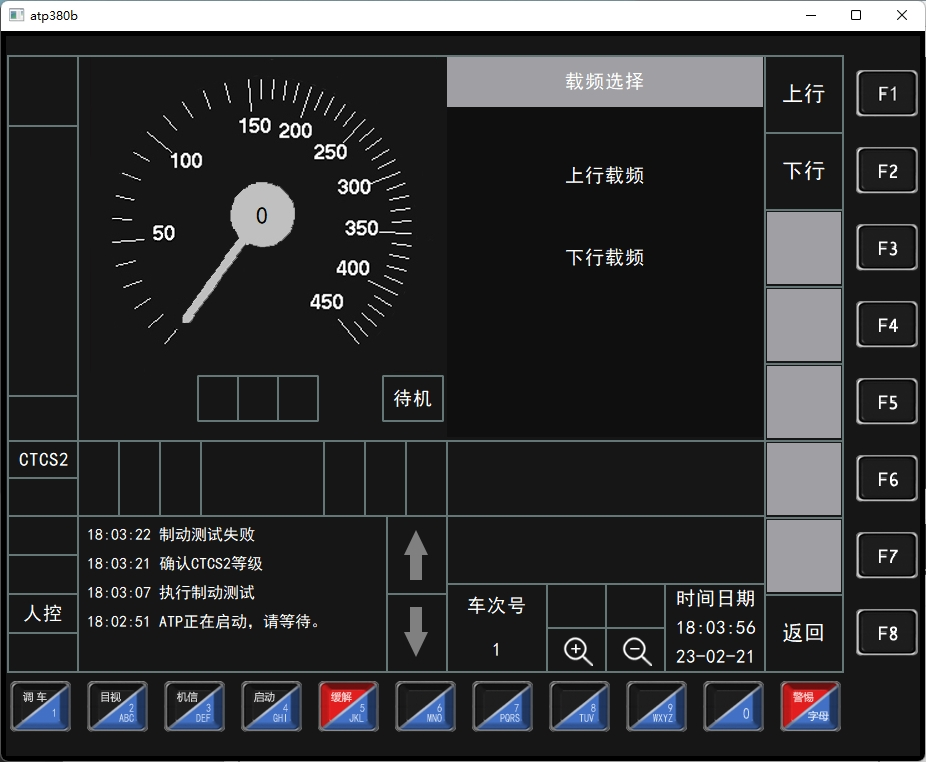
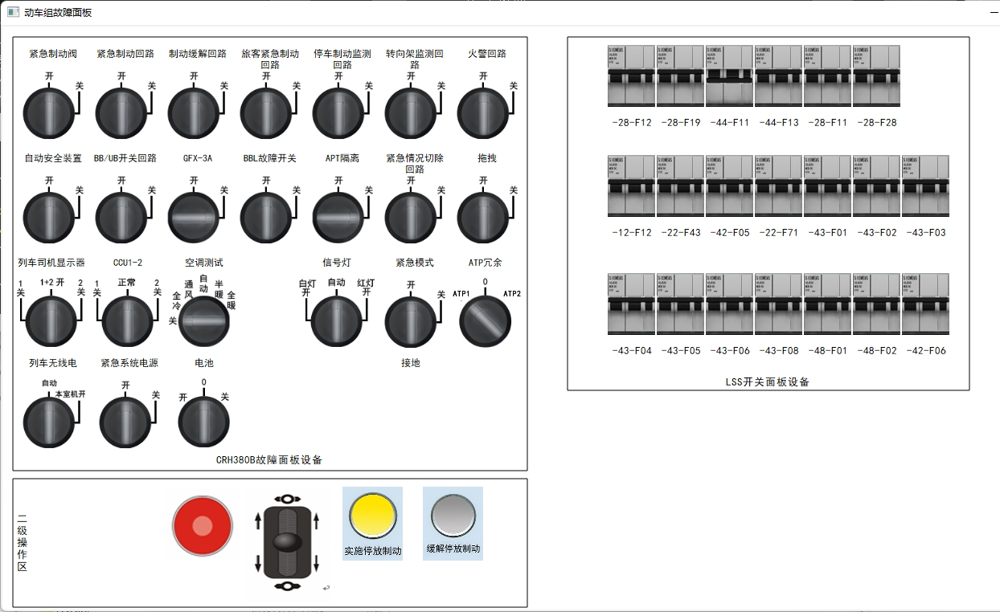
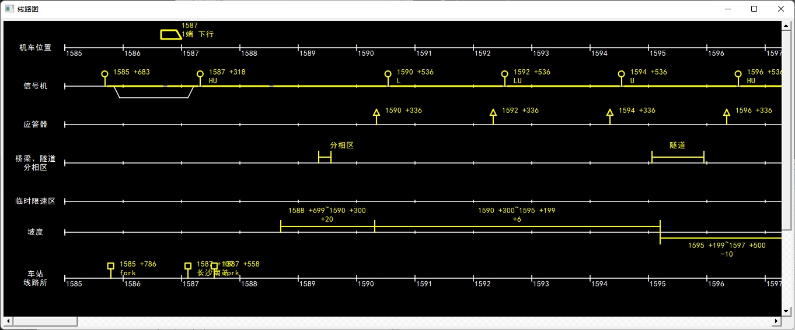
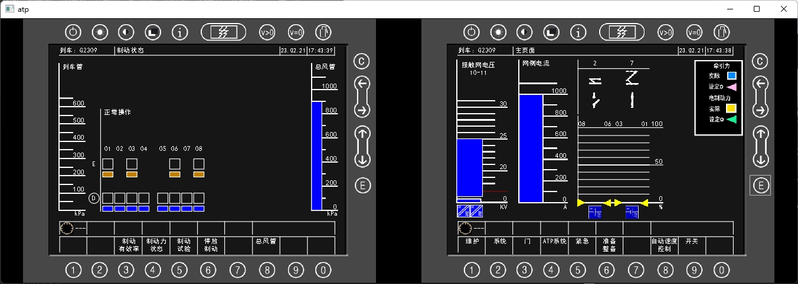
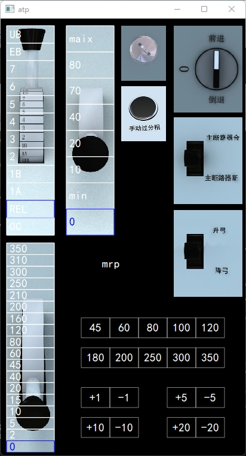

# ATP
ATP子系统(列车自动保护系统)是确保列车运行速度不超过目标速度的安全控制系统。它是列车自动控制（ATC)系统的子系统，也是确保列车安全运行，实现超速防护的关键设备。

本系统完全模拟了ATP子系统，以及高铁的驾驶平台，也可以模拟各种ATP系统可能出现的故障、异常，用于ATP子系统的培训、考核等。

本系统使用QT, C/C++开发，可运行于Windows, Mac OS, Linux等平台。

## 系统功能
1.完全模拟ATP子系统，高铁驾驶界面
2.完全仿真列车驾驶过程
3.可仿真各环节的故障、异常情况
4.所有操作过程生成日志用于考核
5.可自定义站点、路线、坡度等
6.可跨平台，支持Windows, Mac OS, Linux等平台

## 系统截图

## 与我联系
1. QQ: 81224865
2. 邮箱：[tiger.hu.liu@gmail.com](mailto:tiger.hu.liu@gmail.com)

